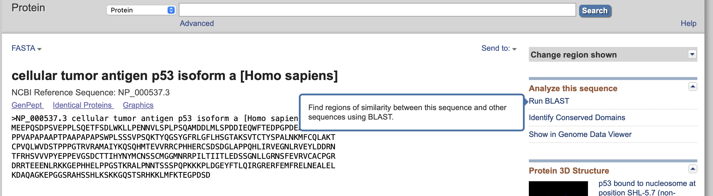
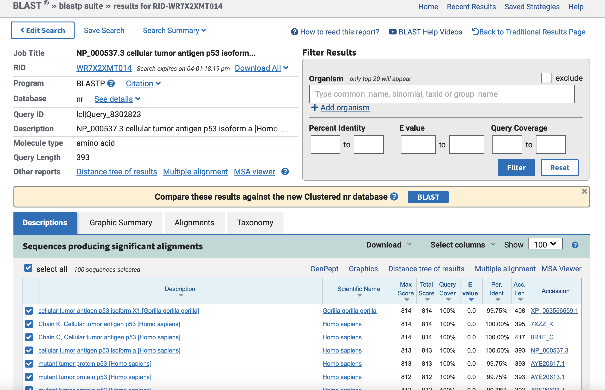
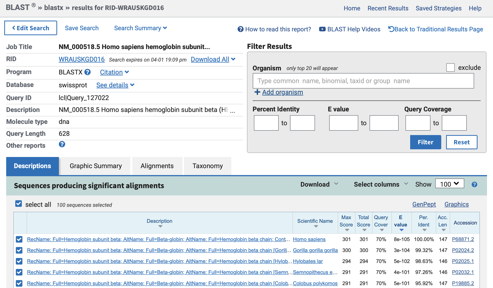
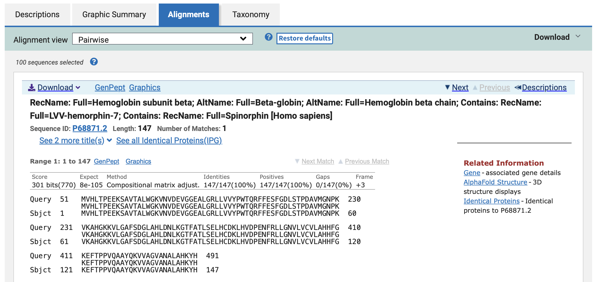
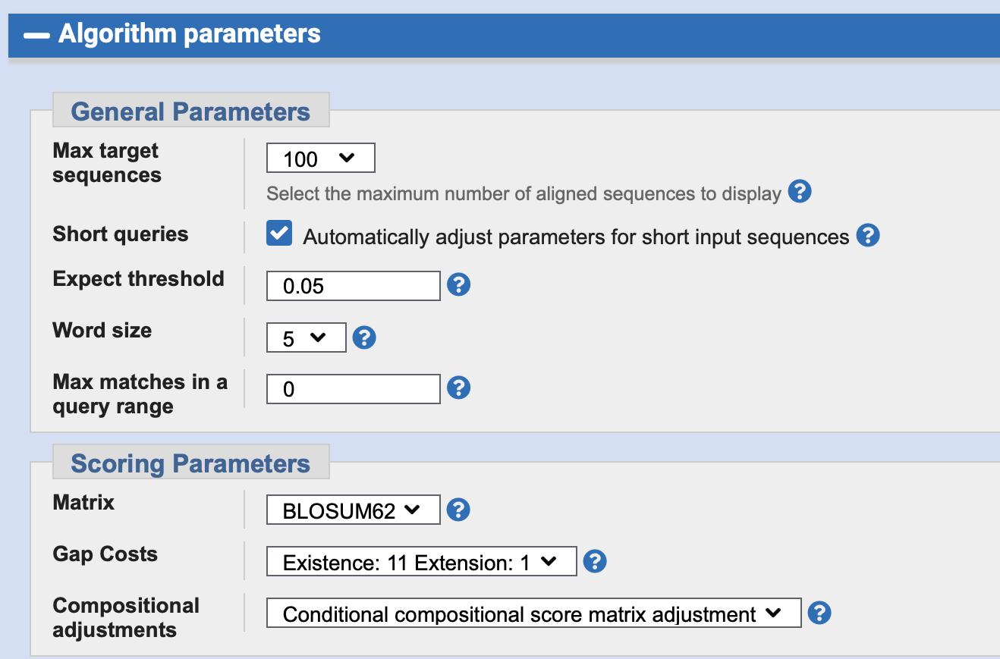

# Этот репозиторий посвящен выполнению Домашних заданий курса Биоинформатики МФТИ 2026 года.
## Скрытые марковские модели (9 апреля)
### Задание 1. Разминка для рук (2 балла)

### Задание 2. Гонка вооружений (2 балла)

## Практическое использование алгоритма BLAST (16 апреля)
### Задание 1. Идентификация белка и интерпретация Е-value.
Дана последовательность белка, которую нужно идентифицировать - NP_000537.3

Запускаем BLAST по базе данных nr и ждем результатов после загрузки.

Неожиданно, но лучшая находка принадлежит не человеку (Homo sapiens), а Gorilla gorilla gorilla, белок называется Cellular tumor antigen p53. 

E-value для первой находки как нельзя хорошее - 0.0. 

### Задание 2. Поиск транслированных последовательностей.
Есть мРНК бета-глобина человека. Воспользуемся сервисом blastx (потому что он работает с translates nucleotides - proteins). blastx — переводит изучаемую нуклеотидную последовательность в кодируемые аминокислоты, а затем сравнивает её с имеющейся базой данных аминокислотных последовательностей белков, что идеально подходит для нашей задачи. Запустим по базе данных Swissprot.

Как видно из скрина рамка считывания +3 оказалась верной для выравнивания с лучшим найденным белком.

Подход использования сервиса blastx надежнее, чем через сторонние программы-трансляторы (хорошо хоть не на диваны-трансляторы), поскольку сервис blastx сможет учесть все рамки считывания в последовательности и выбрать ту, что будет иметь наилучший результат. При этом сторонние программы-трансляторы...

### Задание 3. Влияние матриц аминокислотных замен.
Рассмотрим белок миоглобина человека. Запустим BLASTp для этой последовательности по базе данных SwissProt с BLOSUM62. Ищем гомологи в Danio rerio. Ниже убеждаемся, что BLOSUM62 стоит в параметрах.

Краткая справка: 
